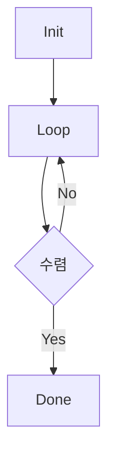

# PW
## Execution Flow

### Init
1. Read input (iosys.f90)
2. Setup parameter (setup.f90)
3. Initialize PWscf (init_run.f90)
* `nscf`, `bands`인 경우 init만 수행.
### SCF
* `scf`인 경우
* Loop에서 SCF 수행.
* 수렴 시 force, stress 등 계산.
### dynamics
* `md`, `relax`, `vc-md`, `vc-relax`인 경우
* SCF 수렴 후 dynamics 계산 수행.
* `md`: force 방향으로 원자 이동. (Molecular Dynamics)
* `relax`: force를 최소화하는 방향으로 원자 이동. (구조 최적화)